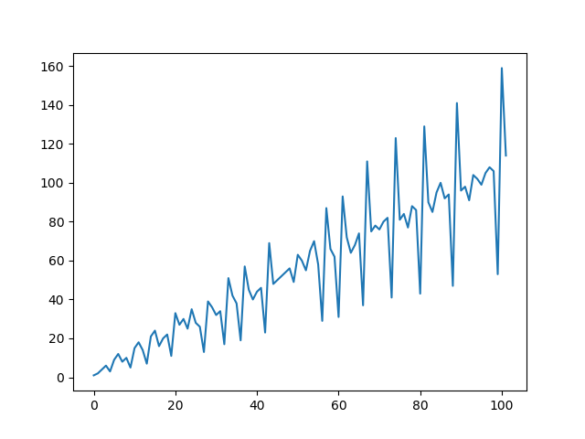

* Rozwiązane zadania należy wysłać mailem na adres tomasz.golan@uwr.edu.pl nie później niż w ciągu 90 minut licząc od rozpoczęcia egzaminu.

* Każde zadanie należy umieścić w osobnym pliku `imie.nazwisko.egzamin.XX.py` gdzie `XX` to numer zadania.

* Punktacja:
  
    * bdb: >= 5.0 pkt
    * db+: >= 4.5 pkt
    * db: >= 4.0 pkt
    * dst+: >= 3.5 pkt
    * dst: >= 3.0 pkt
    
---

## Zadanie 1 (2 pkt)

Napisz program, który przyjmuje dwa argumenty wywołania: promień koła oraz jednostkę (*mm*, *cm* lub *m*). *Program powinien przerywać działanie i drukować odpowiedni komunikat, jeśli podane dane są nieprawidłowe (zła liczba argumentów, promień nie będący liczbą, nieznana jednostka).*

Program powinien liczyć (i drukować na ekranie) pole koła ($P$) oraz informację o kategorii, do której podane koło należy:

* małe koła: $P \leq 1~cm^2$
* średnie koła: $1~cm^2 < P \leq 100~cm^2$
* duże koła: $100~cm^2 < P \leq 10000~cm^2$
* wielkie koła: $P > 10000~cm^2$

## Zadanie 2 (2 pkt)

W pliku `https://tomaszgolan.github.io/wfia_python/data/liczby.txt` znajdują się liczby naturalne oddzielone przecinkiem. Napisz program, który wczytuje te liczby oraz:

* znajduje (i drukuje na ekranie) największą liczbę parzystą i najmniejszą nieparzystą;
* znajduje (i drukuje na ekranie) wszystkie liczby pierwsze;
* tworzy dwa nowe pliki, w których zapisuje odpowiednio wszystkie liczby czterocyfrowe i pięciocyfrowe.

## Zadanie 3 (2 pkt)

Niech $a_k$ będzie ciągiem liczb naturalnych, takich że dwa pierwsze wyrazy to $a_1 = 1$ i $a_2 = 2$, a każdy następny ($a_{k}$, $k>2$) jest najmniejszą liczbą naturalną, która do tej pory nie wystąpiła w ciągu i która nie jest względnie pierwsza z wyrazem bezpośrednio poprzedzającym (tj. $\text{NWD}(a_k, a_{k+1}) > 1$), czyli

```
1, 2, 4, 6, 3, 9, 12, 8, 10, 5, 15, 18, 14, 7, 21, 24, 16...
```

Napisz program, który drukuje *n* pierwszych wyrazów ciągu $a_k$ (jak powyżej - oddzielonych przecinkami). *n* pobierane od użytkownika (ze standardowego wejścia). Program powinien pytać o podanie *n* tak długo, aż zostanie podana prawidłowa wartość (liczba naturalna). *Wskazówka: math.gcd wyznacza największy wspólny dzielnik.*

Dodatkowo program powinien rysować wykres $(k, a_k)$ - przykład dla $n = 100$:


