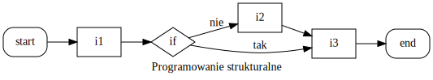

% Języki skryptowe Python
% Wykład 3

<div class='footer'>
Sterowanie: spacja + shift-spacja || page down + page up || strzałki || esc 
</div>

#

## Typ logiczny (boolowski, *boolean*)

---

* przyjmuje wartości: prawda lub fałsz
* w Pythonie następujące wartości są utożsamiane z fałszem:
    * `False`
    * `None`
    * zero dowolnego typu `(0, 0.0, 0j)`
    * pusta sekwencja `''`, `()`, `[]` lub mapowanie `{}`
* pozostałe wartości uznawane są za prawdę

## Operacje logiczne

---

| Operacja | Wynik |
|:--------:|:-----:|
| x or y   | jeśli x jest fałszem, to y, inaczej x |
| x and y  | jeśli x jest fałszem, to x, inaczej y |
| not x    | jeśli x jest fałszem, to True, inaczej False |

## Operacje logiczne - `or`

---

```
print("0 or 0 -> " + str(0 or 0))
print("1 or 0 -> " + str(1 or 0))
print("0 or 1 -> " + str(0 or 1))
print("1 or 1 -> " + str(1 or 1))
```

```
0 or 0 -> 0
1 or 0 -> 1
0 or 1 -> 1
1 or 1 -> 1
```

## Operacje logiczne - `and`

---

```
print("0 and 0 -> " + str(0 and 0))
print("1 and 0 -> " + str(1 and 0))
print("0 and 1 -> " + str(0 and 1))
print("1 and 1 -> " + str(1 and 1))
```

```
0 or 0 -> 0
1 or 0 -> 0
0 or 1 -> 0
1 or 1 -> 1
```

## Operacje logiczne - `not`

---


```
not True
```

```
False
```

```
not False
```

```
True
```

## Dygresja - słowa kluczowe / zastrzeżone

---


```
x = 1     # zmiennej x przypisz wartość 1
y = 2     # zmiennej y przypisz wartość 2
False = 3 # zmiennej False przypusz wartość 3
```

```
False = 3 # zmiennej False przypusz wartość 3
SyntaxError: can't assign to keyword
```

```
import keyword
print(keyword.kwlist)  # lista słów kluczowych w Pythonie
```

```
['False', 'None', 'True', 'and', 'as', 'assert', 'break', 'class', 'continue', 'def', 'del', 'elif', 'else', 'except', 'finally', 'for', 'from', 'global', 'if', 'import', 'in', 'is', 'lambda', 'nonlocal', 'not', 'or', 'pass', 'raise', 'return', 'try', 'while', 'with', 'yield']
```

## Dygresja - niedozwolone nazwy zmiennych

---

* słowa kluczowe
* zaczynające się od cyfry
* zawierające polskie znaki
* zawierające cokolwiek innego niż litery, cyfry i `_`

## Porównania

---

|||
|:--------:|:---------:|
| ==       | równe     |
| !=       | różne     |
| <        | mniejsze  |
| >        | większe   |
| <=       | mniejsze lub równe |
| >=       | większe lub równe  |
| is       | ten sam identyfikator |
| is not   | inny identyfikator |

## Porównania

---

```
1 > 0  # większy niż
```

```
True
```

```
"Prowadzący" > "Student"  # znak po znaku
```

```
False
```

```
"prowadzący" > "Student"  # wielkość ma znaczenie
```

```
True
```

```
"prowadzący" > "2 studentów"  # litera > cyfra
```

```
True
```

#

## Paradygmaty programowania

---

* w Pythonie możliwe jest:
 
    * programowanie strukturalne (typowe dla Fortran, C)
    * programowanie obiektowe (typowe dla C++, Java)
    * programowanie funkcyjne (typowe dla Lisp, Haskell)
    
## Programowanie strukturalne

---

* trzy struktury sterujące:

    * *sekwencja* - wykonanie instrukcji w zadanej kolejności
    * *wybór* - wykonanie instrukcji w zależności od stanu
    * *iteracja* - wykonywanie instrukcji dopóki (nie)spełniony jest warunek



## Instrukcja blokowa

---

* wydzielona część kodu źródłowego (traktowana jak pojedyncza instrukcja)
* w C++ wykorzystuje się klamry

```
int x = 0;

{
    int y = 10; // zmienna lokalna
    x = y + 2;
}

cout << x; // OK
cout << y; // ERROR: nieznana zmienna
```

## Składnia Pythona

---

* instrukcje blokowe wprowadza się za pomocą wcięć

```
// przykład C++
double bezpieczne_dzielenie (int a, int b)
{
    if (b != 0) return a / b;
    else return 0;
}
```

```
# przykład Python
def bezpieczne_dzielenie (a, b):
    if b != 0:
        return a / b
    else:
        return 0
```

## Wcięcia

---

* spacje (zalecane) lub tabulacje
* w Pythonie 3 nie wolno mieszać (w Pythonie 2 się nie zaleca)
* najczęściej wcięce = 4 spacje (czytelność)
* wiele edytorów umożliwia zamianę *tab* na spacje

#

## Instrukcja warunkowa `if`

---

* wykonaj instrukcje, jeśli spełniony jest warunek
  
```
if warunek: # zwróć uwagę na :
    instrukcja1
    instrukcja2
    ...
```

przykład:

```
if 2 > 1:
    print("2 jest większe od 1")
```

```
2 jest większe od 1
```

## Instrukcja warunkowa `if else`

---

* wykonaj instrukcje, jeśli spełniony jest warunek, lub wykonaj inne

```
if warunek:
    instrukcja1
    instrukcja2
    ...
else:
    instrukcja3
    instrukcja4
    ...
```    

przykład:

```
if 2 > 3:
    print("2 jest większe od 3")
else:
    print("2 nie jest większe od 3")
```

```
2 nie jest większe od 3
```

## Instrukcja warunkowa `if elif else`

--- 

* wykonaj jeśli, lub wykonaj jeśli, ..., lub wykonaj

```
if warunek1:
    instrukcja1
    instrukcja2
    ...
elif warunek2:
    instrukcja3
    instrukcja4
    ...
.
.
.
else:
    instrukcja5
    instrukcja6
```

## Instrukcja warunkowa `if elif else` - przykład

--- 


```
if 2 > 3:
    print("2 jest większe od 3")
elif 2 == 3:
    print("2 jest równe 3")
else:
    print("2 jest mniejsze od 3")
```

```
2 jest mniejsze od 3
```

## Przykład zastosowania instrukcji warunkowej

---


```
print("Podaj liczbę:", end=' ')

raw_x = input()  # pobierz stringa z wejścia standardowego
x = eval(raw_x)  # zinterpretuj jako wyrażenie Pythona

# x % 2 zwraca resztę z dzielenia
# każda wartość != 0 jest traktowana jako prawda
if x % 2:
    print("Podana liczba jest nieparzysta.")
else:
    print("Podana liczba jest parzysta.")
```

```
Podaj liczbę: 2
Podana liczba jest parzysta.
```

#

## Dygresja: `input` vs `raw_input`

---

* w Pythonie 2

    * `raw_input` pobiera "surowego" stringa
    * `input` dodatkowo go parsuje

* w Pythonie 3

    * `input` pobiera "surowego" stringa
    * `eval(input)` odtworzy zachowanie `input` z Pythona 2

## Dygresja: `input` i `eval`

---

```
help(input)
```

```
Help on method raw_input in module ipykernel.kernelbase:

raw_input(prompt='') method of ipykernel.ipkernel.IPythonKernel instance
    Forward raw_input to frontends
    
    Raises
    ------
    StdinNotImplentedError if active frontend doesn't support stdin.
```    

```
type(input())  # pobiera wejście jako string
```

```
2
str
```


## Dygresja: `input` i `eval`

---


```
help(eval)
```

```
Help on built-in function eval in module builtins:

eval(source, globals=None, locals=None, /)
    Evaluate the given source in the context of globals and locals.
    
    The source may be a string representing a Python expression
    or a code object as returned by compile().
    The globals must be a dictionary and locals can be any mapping,
    defaulting to the current globals and locals.
    If only globals is given, locals defaults to it.
```    

```
type(eval(input()))  # parsuje wejście jako komendę
```

```
2
int
```

#

## Iteratory

---

* iterator wskazuje element sekwencji oraz umożliwia dostęp do następnego


```
help(iter)
```

```
Help on built-in function iter in module builtins:

iter(...)
    iter(iterable) -> iterator
    iter(callable, sentinel) -> iterator
    
    Get an iterator from an object.  In the first form, the argument must
    supply its own iterator, or be a sequence.
    In the second form, the callable is called until it returns the sentinel.
```    

## `iter(iterable)`

---


```
lista = ['a', 'b', 'c', 'd']  # zwykła lista

it = iter(lista)  # iterator listy (wskazuje na początek)

print(next(it))  # zwraca 1 element i przesuwa "wskaźnik"
print(next(it))  # zwraca 2 element i przesuwa "wskaźnik"
print(next(it))  # zwraca 3 element i przesuwa "wskaźnik"
print(next(it))  # zwraca 4 element i przesuwa "wskaźnik"
```

```
a
b
c
d
```

## `iter(callable, sentinel)`

---

```
i = 0

# funkcje omówimy w przyszłości
def funkcja():
    """Z każdym wywołaniem zwraca kolejną liczbę całkowitą."""
    global i  # użyj globalnej zmiennej i
    i += 1    # zwiększ
    return i  # i zwróć

# kolejne wartości zwracane przez funkcję
# iterowane aż zwróci 4
it = iter(funkcja, 4)

print(next(it))
print(next(it))
print(next(it))
# print(next(it)) # StopIteration
```

```
1
2
3
```

## Pętla `for`

---

* pętla po sekwencji
* np. w Pascalu pętla po (arytmetycznym) ciągu liczb
* np. w C++ obie możliwości

```
// przykład w C++
for (unsigned int i = 0; i < N; i++)
{
    // wykonaj coś na i-tym elemencie
}

for (auto it = v.begin(); it != v.end(); ++it)
{
    // wykonaj coś na iteratorze it
}
```

## `for` po liście

---


```
lista = ['a', 'b', 'c', 'd']

for element in lista:  # pętla po liście, w każdym kroku
    print(element)     # element zmienia swoją wartość
```

```
a
b
c
d
```

## `for` "krok po kroku"

---

```
lista = ['a', 'b', 'c', 'd']

it = iter(lista)

element = next(it)
print(element)
element = next(it)
print(element)
element = next(it)
print(element)
element = next(it)
print(element)
```

```
a
b
c
d
```

## `for` i `next`

---

```
lista = ['a', 'b', 'c', 'd']

it = iter(lista)

# pętla po iteratorze it
# wewnątrz "ręcznie" wywołujemy next()
for i in it:
    print("i = " + str(i))
    print("next(it) = " + str(next(it)))
```

```
i = a         # pierwszy obieg pętli, pierwszy print
next(it) = b  # pierwszy obieg pętli, drugi print, iterator przesunięty
i = c         # w drugim obiegu pętli iterator wskazuje już na trzeci element
next(it) = d  # pętla po czterech elementach kończy się w dwóch obiegach
```

## `for` po wycinkach

---

```
lista = ['a', 'b', 'c', 'd']

for element in lista[-2:]:
    print(element, end=' ')
```

```
c d 
```

```
for i in range(10)[::2]:
    print(i, end=' ')
```

```
0 2 4 6 8 
```

## `for` po krotce

---


```
krotka = ('a', 'b', 'c', 'd')

for element in krotka:  # pętla po krotce
    print(element)      # działa jak po liście
```

```
a
b
c
d
```

## `for` po stringu

---

```
slowo = "Python"

for litera in slowo:  # pętla po stringu
    print(litera)     # iteruje po literach
```

```
P
y
t
h
o
n
```

## `for` po range

---


```
for liczba in range(5):  # pętla po range
    print(liczba)        # "odpowiednik" for (i = 0; ...)
```

```
0
1
2
3
4
```

## Zagnieżdzona pętla

---

```
# sekwencja sekwencji
slowa = ['Ala', 'Ma', 'Kota']

for slowo in slowa:             # pętla po słowach
    for litera in slowo:        # pętla po literach w kolejnych słowach
        print(litera, end=' ')
    
    print()
```

```
A l a 
M a 
K o t a 
```

#

## Pętla `while`

---

* wykonuj blok instrukcji dopóki warunek jest spełniony

```
while warunek:
    instrukcje
```

przykład:


```
i = 0

while i < 5:  # wykonuj dopóki i < 5
    i += 1    # bez tego mamy nieskończoną pętlę
    print(i, end=' ')
```

```
1 2 3 4 5 
```

## `while` - przykład

---

* Dzięki instrukcji sterującej `if` możemy sprawdzić, czy podano takie dane, jakich oczekujemy

```
n = input("Podaj liczbę całkowitą: ")

if n.isdigit():
    print("Twoja liczba to:", n)
else:
    print(n, "nie jest liczbą całkowitą...")
```

```
Podaj liczbę całkowitą: 23
Twoja liczba to: 23
```

## `while` - przykład

---

* Wykorzystując pętlę `while` możemy wymusić, aby podano takie dane, jakich oczekujemy

```
n = input("Podaj liczbę całkowitą: ")

while not n.isdigit():
    n = input("Spróbuj jeszcze raz: ")
    
print("Twoja liczba to:", n)
```

```
Podaj liczbę całkowitą: a
Spróbuj jeszcze raz: 2
Twoja liczba to: 2
```

## `while` - nieskończona pętla

---

* Korzystając z pętli `while` należy zachować ostrożność - łatwo stworzyć nieskończoną pętlę

```
i = 1

while i != 10:
    i += 2
```

#

## Dodatkowe instrukcje sterujące

---

* `break` - przerwij pętlę
* `continue` - przerwij obecną iterację
* `pass` - nie rób nic
* `else` - wykonuj jeśli pętla zakończyła się inaczej niż *break*

## `break`

---

```
for i in range(10):  # drukuj liczby z range(10)
    print(i, end=' ')
    if i > 5:        # przerwij pętlę jeśli i > 5
        break
```

```
0 1 2 3 4 5 6 
```

```
i = 0

while True:    # wykonuj w niekończoność
    print(i, end=' ')
    if i > 5:  # przerwij pętlę jeśli i > 5
        break
    i += 1     # bez tego byłaby nieskończona pętla zer 
```

```
0 1 2 3 4 5 6 
```

## `continue`

---

```
for i in range(10):
    if i % 2:     # jeśli i jest nieparzyste
        continue  # pomiń
    print(i, end=' ')
```

```
0 2 4 6 8 
```

znowu uwaga na nieskończone `while`

```
i = 0

# pętla wydrukuje 0 i utknie na 1
while i < 10: 
    if i % 2:
        continue
    print(i, end=' ')
    i += 1
```

## `pass`

---


```
for i in range(10):
    if i % 2:    # jeśli i jest nieparzyste
        pass     # nie rób nic
    else:        # w innej sytuacji drukuj
        print(i, end=' ')
```

```
0 2 4 6 8 
```

```
i = 0

# w praktyce napisalibyśmy: if not i % 2: print...
while i < 10:
    if i % 2:
        pass
    else:
        print(i, end=' ')
    i += 1
```

```
0 2 4 6 8 
```

## `else`

---

```
for i in range(10):
    if i < 5:  # drukuj mniejsze od 5
        print(i, end=' ')
    else:      # dla pozosyałych nie rób nic
        pass
else:  # wykonaj po zakończeniu pętli
    print("Koniec pętli.")
```

```
0 1 2 3 4 Koniec pętli.
```

```
for i in range(10):
    if i < 5:  # drukuj mniejsze od 5
        print(i, end=' ')
    else:      # przerwij pętlę
        break
else:  # pętla nie doszła do końca przez break
    print("Koniec pętli.")
```

```
0 1 2 3 4
```

#

## Przykład na koniec

---

* Prześledź kolejność wykonywania instrukcji na stronie: [http://pythontutor.com/visualize.html](http://pythontutor.com/visualize.html)

```
for element in (1, 2, 3, 4.0, "python"):
    # jeśli string to drukuj litera po literze
    if type(element) is str:
        for litera in element:
            print(litera)
    # jeśli liczba całkowita
    # to drukuj wszystkie liczby naturalne <= x
    elif type(element) is int:
        while element > 0:
            print(element)
            element -= 1
    # w przeciwnym wypadku nie rób nic
    else:
        continue
    
    print()
```