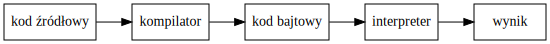

% Języki skryptowe Python
% Wykład 7

<div class='footer'>
Sterowanie: spacja + shift-spacja || page down + page up || strzałki || esc 
</div>

# 

## Własny moduł

---

`my_module.py`

```python
"""To jest mój pierwszy moduł."""

zmienna_globalna = "Unikaj zmiennych globalnych!"

def moja_funkcja():
    """Drukuje zmienną globalną."""
    print(zmienna_globalna)
    
def inna_funkcja(word="", n=0):
    """Drukuje word n razy."""
    print(word * n)
```

## Importowanie własnego modułu

---


```python
import my_module

my_module.zmienna_globalna
```

```bash
'Unikaj zmiennych globalnych!'
```

```python
my_module.moja_funkcja()
```

```bash
Unikaj zmiennych globalnych!
```

```python
my_module.inna_funkcja("-", 10)
```

```bash
----------
```

## Dokumentacja modułu

---


```python
import my_module

help(my_module)
```

```bash
Help on module my_module:

NAME
    my_module - To jest mój pierwszy moduł.

FUNCTIONS
    inna_funkcja(word='', n=0)
        Drukuje word n razy.
    
    moja_funkcja()
        Drukuje zmienną globalną.

DATA
    zmienna_globalna = 'Unikaj zmiennych globalnych!'

FILE
    /doc/insync/scratch/zajęcia/2016/języki skryptowe - python/js-python/my_module.py
```    

## Zawartość modułu

---

```python
import my_module

dir(my_module)
```

```bash
['__builtins__',
    '__cached__',
    '__doc__',
    '__file__',
    '__loader__',
    '__name__',
    '__package__',
    '__spec__',
    'inna_funkcja',
    'moja_funkcja',
    'zmienna_globalna']
```

## *doc*, *file*, *name*, *package*

---

```python
print(my_module.__doc__)   # dokumentacja modułu
```

```bash
To jest mój pierwszy moduł.
```

```python
print(my_module.__file__)  # ścieżka do pliku źródłowego
```

```bash
/doc/insync/scratch/zajęcia/2016/języki skryptowe - python/js-python/my_module.py
```

```python
print(my_module.__name__)  # nazwa modułu
```

```bash
my_module
```

```python
print(my_module.__package__)  # paczka to zbiór modułów
```

## *loader*, *spec*, *cached*

---


```python
# informacja o "loaderze", który został wykorzystany do zaimportowania modułu    
print(my_module.__loader__)
```

```bash
<_frozen_importlib_external.SourceFileLoader object at 0x7f134aded6a0>
```

```python
print(my_module.__spec__)    # ustalane w momencie importowanie modułu
```

```bash
ModuleSpec(name='my_module', loader=<_frozen_importlib_external.SourceFileLoader object at 0x7f134aded6a0>, origin='/doc/insync/scratch/zajęcia/2016/języki skryptowe - python/js-python/my_module.py')
```

```python
print(my_module.__cached__)  # ścieżka do pliku .pyc
```

```bash
/doc/insync/scratch/zajęcia/2016/języki skryptowe - python/js-python/__pycache__/my_module.cpython-35.pyc
```

## Plik *pyc*

---

* plik *pyc* jest wynikiem kompilacji skryptu *py* do kodu bajtowego
* przyp. kod masyznowy -> zrozumiały dla procesora
* kod bajtowy -> zrozumiały dla maszyny wirtualnej / interpretera


## Kompilowany czy interpretowany?

---

* uwaga: implementacja języka (a nie język sam w sobie) może być kompilowany lub interpretowany



#

## Skrypt jako "zbior definicji"

---

`my_module.py`

```python
"""To jest mój pierwszy moduł."""

zmienna_globalna = "Unikaj zmiennych globalnych!"

def moja_funkcja():
    """Drukuje zmienną globalną."""
    print(zmienna_globalna)
    
def inna_funkcja(word="", n=0):
    """Drukuje word n razy."""
    print(word * n)
```

```bash
python my_module.py
```

## Skrypt wykonujący operacje

---

```python
"""To jest mój pierwszy moduł."""

zmienna_globalna = "Unikaj zmiennych globalnych!"

def moja_funkcja():
    """Drukuje zmienną globalną."""
    print(zmienna_globalna)
    
def inna_funkcja(word="", n=0):
    """Drukuje word n razy."""
    print(word * n)
    
inna_funkcja('-', 10)
moja_funkcja()
inna_funkcja('-', 10)
```

```bash
python my_module.py
```

```bash
----------
Unikaj zmiennych globalnych!
----------
```

## Wykonywanie podczas importowania

---

```bash
Python 3.5.2 |Anaconda 4.2.0 (64-bit)| (default, Jul  2 2016, 17:53:06) 
[GCC 4.4.7 20120313 (Red Hat 4.4.7-1)] on linux
Type "help", "copyright", "credits" or "license" for more information.
>>> import my_module
----------
Unikaj zmiennych globalnych!
----------
>>> 
```

## "Funkcja *main*"

---

```python
"""To jest mój pierwszy moduł."""

zmienna_globalna = "Unikaj zmiennych globalnych!"

def moja_funkcja():
    """Drukuje zmienną globalną."""
    print(zmienna_globalna)
    
def inna_funkcja(word="", n=0):
    """Drukuje word n razy."""
    print(word * n)

if __name__ == "__main__":
    inna_funkcja('-', 10)
    moja_funkcja()
    inna_funkcja('-', 10)
```

```bash
python my_module.py
```

```bash
----------
Unikaj zmiennych globalnych!
----------
```

## Importowanie a *main*

---

* instrukcje w *main* nie zostaną wykonane podczas importowania (bo `__name__` = nazwa modułu)

```bash
Python 3.5.2 |Anaconda 4.2.0 (64-bit)| (default, Jul  2 2016, 17:53:06) 
[GCC 4.4.7 20120313 (Red Hat 4.4.7-1)] on linux
Type "help", "copyright", "credits" or "license" for more information.
>>> import my_module
>>> 
```

#

## Prywatność

---

`private.py`

```python
public = "public"
# _ przed nazwą -> from ... import * pomija
_internal = "internal use"
```

```python
from private import *  # importuj wszystko 
```

```python
print(public)
```

```bash
'public'
```

```python
print(_internal)
```

```bash
...    
NameError: name '_internal' is not defined
```

#

## Gdzie interpreter szuka modułów?

---

1. bieżący katalog
2. w katalogach określonych w zmiennej środowiskowej `PYTHONPATH`
3. w katalogach określonych w trakcie instalacji (np. `/usr/lib/python`)
4. w katalogach określonych w zmiennej `sys.path`

## Zmienne środowiskowe

---

* zmienne powłoki systemowej

```bash
goran@goran-ift:~$ export MOJA_ZMIENNA="wartość mojej zmiennej"
goran@goran-ift:~$ echo $MOJA_ZMIENNA 
wartość mojej zmiennej
```

* część zmiennych jest inicjowana przy starcie powłoki, np

```bash
goran@goran-ift:~$ echo $PATH
/home/goran/soft/anaconda3/bin:/usr/local/sbin:/usr/local/bin:/usr/sbin:/usr/bin:/sbin:/bin:/usr/games:/usr/local/games:/snap/bin
```

## Zmienne środowiskowe

---

* zmienne można aktualizować

```bash
goran@goran-ift:~$ export PATH=/newpath/:$PATH
goran@goran-ift:~$ echo $PATH
/newpath/:/home/goran/soft/anaconda3/bin:/usr/local/sbin:/usr/local/bin:/usr/sbin:/usr/bin:/sbin:/bin:/usr/games:/usr/local/games:/snap/bin
```

## *sys.path*

---

```python
import sys

sys.path
```
```bash
['',
'/home/goran/soft/anaconda3/lib/python35.zip',
'/home/goran/soft/anaconda3/lib/python3.5',
'/home/goran/soft/anaconda3/lib/python3.5/plat-linux',
'/home/goran/soft/anaconda3/lib/python3.5/lib-dynload',
'/home/goran/soft/anaconda3/lib/python3.5/site-packages',
'/home/goran/soft/anaconda3/lib/python3.5/site-packages/Sphinx-1.4.6-py3.5.egg',
'/home/goran/soft/anaconda3/lib/python3.5/site-packages/setuptools-27.2.0-py3.5.egg',
'/home/goran/soft/anaconda3/lib/python3.5/site-packages/IPython/extensions',
'/home/goran/.ipython']
```

## *sys.path*

---

```python
sys.path.append("/moja/sciezka/do/modulow")

sys.path
```

```bash
['',
'/home/goran/soft/anaconda3/lib/python35.zip',
'/home/goran/soft/anaconda3/lib/python3.5',
'/home/goran/soft/anaconda3/lib/python3.5/plat-linux',
'/home/goran/soft/anaconda3/lib/python3.5/lib-dynload',
'/home/goran/soft/anaconda3/lib/python3.5/site-packages',
'/home/goran/soft/anaconda3/lib/python3.5/site-packages/Sphinx-1.4.6-py3.5.egg',
'/home/goran/soft/anaconda3/lib/python3.5/site-packages/setuptools-27.2.0-py3.5.egg',
'/home/goran/soft/anaconda3/lib/python3.5/site-packages/IPython/extensions',
'/home/goran/.ipython',
'/moja/sciezka/do/modulow']
```


## Moduł poza katalogiem roboczym

---

`trojmian.py`

```python
"""Moduł do obsługi trómianu kwadratowego."""

from math import sqrt

def _delta(a, b, c):
    """Liczy wyróżnik trójmianu."""
    return b**2 - 4*a*c

def _solve(a, b, d):
    """Liczy miejsca zerowe."""
    d = sqrt(d)
    return (-b + d) / 2 / a, (-b - d) / 2 / a

def solution(a, b, c):
    """Zwraca miejsca zerowe."""
    d = _delta(a, b, c)
    
    if d < 0:return None
    elif d == 0: return -b / 2 / a
    else: return _solve(a, b, d) 
```

## Moduł poza katalogiem roboczym

---

```python
# nie ma w katalogu roboczym ani w PYTHONPATH itd
import trojmian
```

```bash
ImportError: No module named 'trojmian'
```

```python
import sys
sys.path.append("/home/goran/")  # dodajemy ścieżkę do sys.path
import trojmian                  # teraz działa
```

## Trójmian w akcji

---

```python
help(trojmian)  # nie ma _delta, ale jest sqrt!
```

```bash
Help on module trojmian:

NAME
    trojmian - Moduł do obsługi trómianu kwadratowego.

FUNCTIONS
    solution(a, b, c)
        Zwraca miejsca zerowe.
    
    sqrt(...)
        sqrt(x)
        
        Return the square root of x.

FILE
    /home/goran/trojmian.py
```    
    
## Trójmian w akcji

---

```python
from trojmian import *  # importuj wszystko
```

```python
solution(1, 2, 1)       # dostęp do solution
```

```bash
-1.0
```

```python
sqrt(4)                 # dostęp do sqrt z math!
```

```bash
2.0
```

```python
_delta(1, 2, 1)         # ale _delta nie została zaimportowana
```

```bash
...
NameError: name '_delta' is not defined
```

#

## Paczka

---

* uporządkowany zbiór modułów

```bash
package_name/     # top-level
    __init__.py   # wymagane (może być puste)
    subpackage1/
        __init__.py
        module1.py
        module2.py
        ...
    subpackage2/
        __init__.py
        ...
``` 

## *__init__.py*

---

*Przykład dotyczy listy 4 z poprzednich lat.*

`listy_zadan/__init__.py`

```python
"""Inicjalizacja paczki listy_zadan"""
import math  # można np. importować moduły
```

`listy_zadan/lista4/__init__.py`

```python
"""Inicjalizacja podpaczki lista4"""
```

## Lista 4 - zadanie 2

---

`listy_zadan/lista4/zad2.py`

```python
"""Napisz funkcję, która znajduje mniejszą liczbę z dwóch podanych."""

def min2(a, b):
    """Zwraca mniejszą z dwóch podanych liczb."""
    if a > b:
        return b
    return a
```

## Lista 4 - zadanie 3

---

`listy_zadan/lista4/zad3.py`

```python
"""Napisz funkcję, która z podanych liczb (ilość dowolna) znajduje najmniejszą."""

from listy_zadan.lista4.zad2 import min2

def min(*a):
    """Zwraca najmniejszą z podanych liczb."""
    current_min = a[0]
    
    for x in a:
        current_min = min2(current_min, x)
    
    return current_min
```

## Importowanie

---

```python
import listy_zadan.lista4.zad2
import listy_zadan.lista4.zad3 as zad3

print("Zad2 =", listy_zadan.lista4.zad2.min2(1, 5))
print("Zad3 =", zad3.min(6, 2, 6, 3, 5))
```

```bash
Zad2 = 1
Zad3 = 2
```