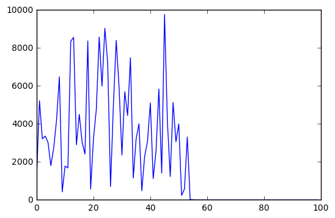
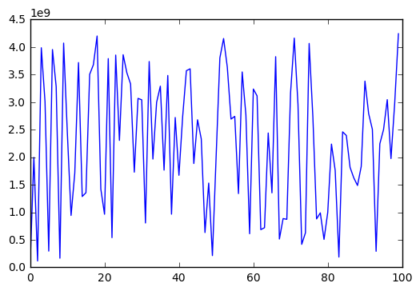
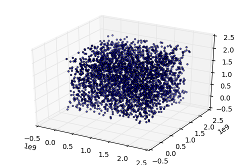
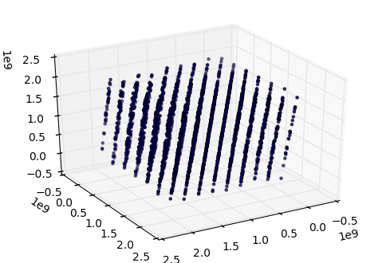
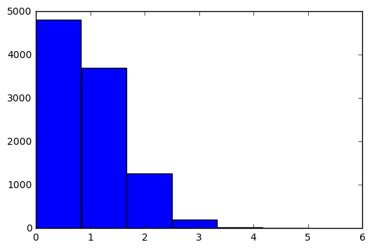

% Języki skryptowe Python
% Wykład 10

<div class='footer'>
Sterowanie: spacja + shift-spacja || page down + page up || strzałki || esc 
</div>

# 

## Generatory liczb pseudolosowych

---

* nie jest możliwe wygenerowanie liczby prawdziwie losowej
* możliwe jest wygenerowanie (na bazie liczby wejściowej, *seed*) ciągu liczb pseudolosowych
    * ten sam *seed* = ten sam ciąg
    * maksymalna ilość ciągów = możliwe *seedy*
    * okresowość

## *Middle square method*

---


<div class="left"><br>

* stworzony przez Johna von Neumanna
* Wykorzystany w
    * ENIAC (jeden z pierwszych komputerów na świecie)
    * Projekt Manhattan

</div>

## *Middle square method* - algorytm

---

* weź liczbę 4-cyfrową jako *seed* (w ogólności można wziać *n*-cyfrową liczbę)
* podnieś do kwadratu, aby otrzymać liczbę 8-cyfrową (dodaj zera, jeśli trzeba)
* 4 środkowe cyfry są wynikiem i *seedem* dla następnej liczby

$$1111^2 = 01234321 \rightarrow 2343$$
$$2343^2 = 05489649 \rightarrow 4896$$
$$4896^2 = 23970816 \rightarrow 9708$$

## *Middle square method* - implementacja

---

`middle2.py`

```python
"""PRNG using middle-square method."""

def _middle2(n):
    """Return next random number."""
    return int(str(n*n).zfill(8)[2:6])

def generate(n, seed=1111):
    """Generate n numbers starting with seed."""
    numbers = []
    for _ in range(n):
        numbers.append(seed)
        seed = _middle2(seed)
    return numbers
```

## *Middle square method* - wyniki

---

<div class="left">

```python
import matplotlib.pyplot as plt
import middle2

size, seed = 100, 1234

x = range(size)
y = middle2.generate(size, seed)

plt.plot(x, y)
```

</div>



## Algorytm LCG

---

* LCG = linear congruential generator
* zaimplementowany w wielu językach
* prosty i szybki
* silne korelacje - nie nadaje się do symulacji Monte Carlo (i tym bardziej kryptografii)

$$X_{n+1} = (aX_n + c) \text{ mod } m$$

## Algorytm LCG - implementacja

---

<div class="left">

```python
import matplotlib.pyplot as plt

def lcg(seed, m, a, c):
    """Return next random number using LCG."""
    return (seed * a + c) % m

size, seed = 100, 1234
a, c, m = 48271, 0, 2**32 - 1  # C++11 minst_rand

random_numbers = []

for _ in range(size):
    seed = lcg(seed, m, a, c)
    random_numbers.append(seed)

x = range(size)

plt.plot(x, random_numbers)
```

</div>



## Algorytm LCG - korelacje

---


```python
# Mathematics and Computers in Simulations 46 (1998) 485-505
seed = 1
a = 65539
c = 0
m = 2**31

punkty = []  # losowe punkty

for _ in range(9600):
    seed = lcg(seed, m, a, c)
    punkty.append(seed)
    
x = punkty[::3]   # współrzędne x
y = punkty[1::3]  # współrzędne y
z = punkty[2::3]  # współrzędne z
```

## Algorytm LCG - punkty 3D

---

<div class="left">

```python
import matplotlib.pyplot as plt
from mpl_toolkits.mplot3d import Axes3D
from time import sleep

fig = plt.figure()
ax = fig.add_subplot(111, projection='3d')

ax.scatter(x, y, z, marker='.')
```

</div>



## Algorytm LCG - punkty 3D

---

<div class="left">

```python
import matplotlib.pyplot as plt
from mpl_toolkits.mplot3d import Axes3D

fig = plt.figure()
ax = fig.add_subplot(111, projection='3d')

ax.view_init(30, 60)

ax.scatter(x,y,z, marker='.')
```

</div>


#

## Moduł *random*

---

* generator Mersenne Twister
* zaniedbywalna korelacja między kolejnymi liczbami (dobry do symulacji Monte Carlo)
* przewidywalność (nie nadaje się do kryptografii)
* szybki, ale "nieelegancki"

## Losowe liczby zmiennoprzecinkowe

---

```python
import random

# random.random() -> losowa liczba z [0, 1)

losowe = [random.random() for _ in range(10)]

print(losowe)
```

```bash
[0.2698846730753022, 0.39646893011652196, 0.3569316622351202, 0.7422356288778353, 0.9872672338526717, 0.8037923911064603, 0.8702317548225692, 0.4956627050929412, 0.3254081126694237, 0.3929978024317329]
```

```python
# random.uniform(a, b) -> losowa z przedziału [a, b]

losowe = [random.uniform(99, 100) for _ in range(10)]

print(losowe)
```

```bash
[99.99533728109901, 99.59952026049403, 99.42567811786209, 99.78233290994207, 99.84681728147966, 99.53305937003043, 99.47972787766165, 99.94064273021912, 99.8788743089142, 99.76186755697995]
```

## Losowe liczby całkowite

---


```python
import random

# random.randint(a, b) - losowa całkowita z [a, b]

losowe = [random.randint(1, 10) for _ in range(10)]

print(losowe)
```

```bash
[4, 3, 7, 2, 5, 3, 6, 6, 5, 1]
```


```python
# random.randrange(stop) -> losowa < stop
# random.randrange(start, stop[, step])

losowe = [random.randrange(10) for _ in range(10)]

print(losowe)
```

```bash
[7, 5, 0, 2, 4, 5, 1, 1, 1, 4]
```

## Losowe z sekwencji

---

```python
import random

x = "Python"
y = ['a', 'b', 'c', 1, 2, 3]
```

```python
random.choice(x)     # losowa litera z str
```

```bash
'o'
```

```python
random.choice(y)     # losowy element listy
```

```bash
2
```


```python
random.sample(y, 3)  # losowy podzbiór
```

```bash
[1, 3, 'b']
```

## Seed

---


```python
import random

for _ in range(5):
    print(random.random())
```

```bash
0.5943111012611626
0.7799061974116444
0.9688698425524694
0.09623949574155088
0.7030765207216848
```

```python
for _ in range(5):
    random.seed(1234)  # stały seed -> stała wartość
    print(random.random())
```

```bash
0.9664535356921388
0.9664535356921388
0.9664535356921388
0.9664535356921388
0.9664535356921388
```

#

## Przykład: Totolotek

---


```python
from random import randint

def losowanie():
    """Losuje 6 liczb od 1 do 49."""
    # TODO: liczby nie mogą się powtarzać
    return sorted([randint(1, 49) for _ in range(6)])

def check(a, b):
    """Sprawdza ilość takich samych elementów."""
    return len([n for n in a if n in b])

def play():
    """Gra w lotka."""
    lotto = losowanie()  # losowanie lotto
    kupon = losowanie()  # kupon chybił-trafił
    return check(kupon, lotto)
```

## Totolotek - symulacja

---

<div class="left">

```python
import matplotlib.pyplot as plt

n = 10000  # ilość gier

wyniki = [play() for _ in range(n)] 
    
plt.hist(wyniki, 6)
```

</div>


#

## Typy sekwencyjne 

---

* do tej pory poznaliśmy cztery typy sekwencyjne:
    * *str* - typ tekstowy
    * *list* - *mutowalna* sekwencja
    * *tuple* - *niemutowalna* sekwencja
    * *range* - *niemutowalna* sekwencja liczb

## Sekwencja *set*

---

* *set* jest *mutowalną* sekwencją
* różnice względem *list*
    * nie może zawierać duplikatów
    * jest nieuporządkowana
    * może zawierać tylko *hashowalne* obiekty

## Definiowanie *set*

---

```python
zbior = {1, 4, 6, 2, 1}  # nawiasy klamrowe

print(type(zbior))
```

```bash
set
```

```python
print(zbior)  # tylko jedna 1
```

```bash
{1, 2, 4, 6}
```

```python
zbior[0]  # nie ma indeksowania zbiorów
```

```bash
TypeError: 'set' object does not support indexing
```

## *set* z *list*

---


```python
lista = [1, 4, 6, 2, 1]

zbior = set(lista)  # stwórz zbiór na bazie listy

print(zbior)        # duplikaty zostaną usunięte
```

```
{1, 2, 4, 6}
```

## Dodawanie elementów do zbioru

---


```python
zbior = {1, 2, 3}

print(zbior)
```

```bash
{1, 2, 3}
```

```python
zbior.add(4)  # dodaj 4

print(zbior)
```

```bash
{1, 2, 3, 4}
```

```python
zbior.add(4)  # jeszcze raz dodaj 4

print(zbior)  # nie ma duplikatów
```

```bash
{1, 2, 3, 4}
```

## Elementy *niehashowalne*

---

```python
zbior = {1, 2, 3}

lista = [4, 5]  # lista jest niehashowalna

# zbiór nie może przechowywać elementów niehashowalnych
zbior.add(lista)
```

```bash
TypeError: unhashable type: 'list'
```

## Sekwencje hashowalne

---

```python
zbior = {1, 2, 3}

krotka = (4, 5)  # krotka jest hashowalna

# więc można dodać krotkę do zbioru
zbior.add(krotka)

print(zbior)
```

```bash
{(4, 5), 1, 2, 3}
```

## Usuwanie elementów ze zbioru

---

```python
zbior = {1, 2, 3}

zbior.remove(1)  # usuń 1

print(zbior)
```

```bash
{2, 3}
```

```python
# zwróci błąd jeśli element nie istnieje
zbior.remove(1)
```

```bash
KeyError: 1
```

## Bezpieczne usuwanie?

---

```python
zbior = {1, 2, 3}

# aby uniknąć błędów i przerwania programu
# można sprawdzić, czy na pewno element znajduje się w zbiorze
if 1 in zbior:
    zbior.remove(1)
```

```python
# lub skorzystać z try...except
try:
    zbior.remove(1)
except:
    pass
```

```python
# lub skorzystać z discard
zbior.discard(1)
```

## Zastosowanie zbiorów

---


```python
# usuwanie duplikatów z listy

lista = [2, 1, 2, 3, 4, 3, 2, 1, 5, 5, 2]

lista = list(set(lista))

# uwaga - tracimy kolejność
print(lista)
```

```bash
[1, 2, 3, 4, 5]
```

## Część wspólna zbiorów

---

```python
A = {1, 2, 3, 4, 5}
B = {3, 4, 5, 6, 7}

print(A.intersection(B))  # część wspólna A i B
```

```bash
{3, 4, 5}
```

```python
# lub krócej
print(A & B)
```

```bash
{3, 4, 5}
```


## Część wspólna list

---


```python
A = [1, 2, 3, 4, 5]
B = [3, 4, 5, 6, 7]

# rzutuje A i B na zbiory
# wyznacza ich część wspólną
# rzutuje na listę
wspolna = list(set(A) & set(B))

print(wspolna)
```

```bash
[3, 4, 5]
```

## *frozenset*

---

* jak *set* ale *niemutowalny*, czyli nie można modyfikować zawartości


```python
zamrozony_zbior = frozenset([1, 2, 3, 4, 5])

type(zamrozony_zbior)
```

```bash
frozenset
```

```python
zamrozony_zbior.add(1)  # nie można dodawać / usuwać
```

```bash
AttributeError: 'frozenset' object has no attribute 'add'
```

#

## Przykład: Totolotek

---


```python
from random import randint

def losowanie():
    """Losuje 6 liczb od 1 do 49."""
    # TODO: liczby nie mogą się powtarzać
    return sorted([randint(1, 49) for _ in range(6)])

def check(a, b):
    """Sprawdza ilość takich samych elementów."""
    return len([n for n in a if n in b])

def play():
    """Gra w lotka."""
    lotto = losowanie()  # losowanie lotto
    kupon = losowanie()  # kupon chybił-trafił
    return check(kupon, lotto)
```

## Totolotek z *set*

---


```python
from random import randint

def losowanie():
    """Losuje 6 liczb od 1 do 49."""
    los = set()  # tutaj zapiszemy wyniki losowania

    while len(los) < 6:  # dodawaj aż 6 unikatów
        los.add(randint(1, 49))
    
    return los

def check(a, b):
    """Sprawdza ilość takich samych elementów."""
    return len(a & b)
```

## Totolotek - test

---

```python
lotto = losowanie()
kupon = losowanie()

print(lotto, kupon, sep="\n")
```

```bash
{35, 7, 12, 16, 48, 29}
{32, 10, 13, 26, 29, 31}
```


```python
check(lotto, kupon)
```

```bash
1
```


## Totolotek z *frozenset*

---


```python
from random import sample

# frozenset bo losowania nie będziemy modyfikować

def losowanie():
    """Losuje 6 liczb od 1 do 49."""
    los = sample(range(1, 50), 6) # sample gwarantuje brak powtórzeń
    return frozenset(los)         # zwracamy jako zamrożony zbiór

def check(a, b):
    """Sprawdza ilość takich samych elementów."""
    return len(a & b)
```

## Totolotek - test

---


```python
lotto = losowanie()
kupon = losowanie()

print(lotto, kupon, sep="\n")
```

```bash
frozenset({37, 46, 48, 19, 25, 31})
frozenset({38, 40, 41, 18, 19, 30})
```


```python
check(lotto, kupon)
```

```bash
1
```
